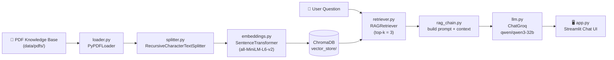

<div align="center">


<a href="#">
  
</a>

<br/>

[](https://www.python.org/)
[](https://streamlit.io/)
[](https://www.langchain.com/)
[](https://www.trychroma.com/)
[](https://groq.com/)
[](https://www.sbert.net/)

[]()
[]()
[]()

</div>

---

### 🩺 About

**Medical RAG Chatbot** is a Retrieval-Augmented Generation assistant that answers medical questions grounded in a real knowledge base — *The Gale Encyclopedia of Medicine (2nd Edition)*. Instead of hallucinating answers, it retrieves the most relevant passages from the source text and lets a Groq-hosted LLM reason over them, all through a clean Streamlit chat interface.

> ⚠️ **Disclaimer:** This project is for educational/demo purposes only. It is **not** a substitute for professional medical advice, diagnosis, or treatment.

---

## 📑 Table of Contents

- [✨ Features](#-features)
- [🧠 How It Works](#-how-it-works)
- [🛠️ Tech Stack](#️-tech-stack)
- [📂 Project Structure](#-project-structure)
- [⚙️ Installation](#️-installation)
- [🔑 Environment Variables](#-environment-variables)
- [🚀 Usage](#-usage)
- [🎛️ Configuration](#️-configuration)
- [🗺️ Roadmap](#️-roadmap)
- [📝 Notes & Limitations](#-notes--limitations)
- [🤝 Contributing](#-contributing)
- [📜 License](#-license)

---

## ✨ Features

- 💬 **Chat-style UI** — built with Streamlit's native chat elements, with full session-based conversation history.
- 📚 **Document-grounded answers** — every response is generated from chunks retrieved out of an ingested PDF knowledge base, not from the model's raw memory.
- 🔍 **Semantic search** — queries and documents are embedded using `all-MiniLM-L6-v2` and matched via cosine similarity in ChromaDB.
- ⚡ **Fast inference** — answers are generated by Groq's `qwen/qwen3-32b` model for low-latency responses.
- 🗂️ **Persistent vector store** — embeddings are stored on disk so the knowledge base only needs to be built once.
- 🧩 **Modular pipeline** — loading, splitting, embedding, storing, and retrieving are all cleanly separated into individual modules.
- 🚀 **Cached resource loading** — heavy objects (models, vector store, retriever) are loaded once via `st.cache_resource` for snappy reloads.

---

## 🧠 How It Works



**Two phases:**

1. **Ingestion** (`ingestion.py`, run once) — loads every PDF in `data/pdfs/`, splits it into 500-character chunks (50-char overlap), embeds each chunk, and persists everything into a local ChromaDB collection (`vector_store/`).
2. **Inference** (`app.py`, run every session) — embeds the user's question, retrieves the 3 most relevant chunks, stuffs them into a prompt as context, and sends it to the Groq LLM to produce a grounded answer.

---

## 🛠️ Tech Stack

| Layer | Technology | Purpose |
|---|---|---|
| 🖥️ UI | **Streamlit** | Chat interface & session state |
| 🔗 Orchestration | **LangChain** (core/community) | Loaders, splitters, chaining |
| 🤖 LLM | **Groq** — `qwen/qwen3-32b` | Answer generation |
| 🧬 Embeddings | **Sentence-Transformers** — `all-MiniLM-L6-v2` | Text → vector encoding |
| 🗄️ Vector DB | **ChromaDB** (persistent client) | Similarity search |
| 📄 PDF Parsing | **PyPDFLoader** / **PyMuPDF** | Extracting text from PDFs |
| 🔐 Config | **python-dotenv** | Loading API keys from `.env` |
| 📦 Package Manager | **uv** (`uv.lock`) / pip | Dependency management |

---

## 📂 Project Structure

```
Medical_chatbot/
├── data/
│   └── pdfs/
│       └── The_GALE_ENCYCLOPEDIA_of_MEDICINE_SECOND.pdf   # Knowledge source
├── src/
│   ├── loader.py            # Loads all PDFs from data/pdfs/
│   ├── splitter.py          # Chunks documents into smaller passages
│   ├── embeddings.py        # Generates sentence embeddings
│   ├── vector_store.py      # ChromaDB persistence layer
│   ├── retriever.py         # Embeds query + fetches top-k chunks
│   ├── rag_chain.py         # Builds the final prompt & calls the LLM
│   ├── llm.py                # Groq LLM client configuration
│   └── prompt_template.py    # (reserved for future prompt templates)
├── vector_store/             # Persisted ChromaDB index (auto-generated)
├── app.py                    # Streamlit entry point
├── ingestion.py               # One-time script to build the vector store
├── pyproject.toml             # Project metadata & dependencies (uv)
├── requirements.txt            # Dependencies (pip)
├── uv.lock                     # Locked dependency versions
├── .python-version              # Pinned Python version (3.14)
└── .env                          # Local secrets — GROQ_API_KEY (never commit!)
```

---

## ⚙️ Installation

### Prerequisites
- Python **3.14+**
- A free [Groq API key](https://console.groq.com/keys)

### 1. Clone the repository
```bash
git clone https://github.com/<your-username>/Medical_chatbot.git
cd Medical_chatbot
```

### 2. Install dependencies

<details open>
<summary><b>Using <code>uv</code> (recommended — matches <code>uv.lock</code>)</b></summary>

```bash
uv sync
```
</details>

<details>
<summary><b>Using <code>pip</code></b></summary>

```bash
python -m venv .venv
source .venv/bin/activate      # Windows: .venv\Scripts\activate
pip install -r requirements.txt
```
</details>

---

## 🔑 Environment Variables

Create a `.env` file in the project root:

```env
GROQ_API_KEY="your_groq_api_key_here"
```

> 🔒 `.env` is already listed in `.gitignore` — never commit real API keys to version control, and rotate any key that's ever been shared or exposed.

---

## 🚀 Usage

### Step 1 — Build the vector store (run once, or whenever your PDFs change)
```bash
python ingestion.py
```
This loads every PDF in `data/pdfs/`, chunks it, embeds it, and persists the index into `vector_store/`.

### Step 2 — Launch the chatbot
```bash
streamlit run app.py
```
Then open the local URL Streamlit prints (typically `http://localhost:8501`) and start asking medical questions in the chat box. 💬

---

## 🎛️ Configuration

Quick reference for the knobs you can tune directly in the source files:

| Setting | File | Default | Description |
|---|---|---|---|
| `chunk_size` | `src/splitter.py` | `500` | Characters per text chunk |
| `chunk_overlap` | `src/splitter.py` | `50` | Overlap between consecutive chunks |
| `top_k` | `src/retriever.py` | `3` | Number of chunks retrieved per query |
| `model_name` | `src/embeddings.py` | `all-MiniLM-L6-v2` | Sentence embedding model |
| `model_name` | `src/llm.py` | `qwen/qwen3-32b` | Groq-hosted chat model |
| `temperature` | `src/llm.py` | `0.7` | LLM response creativity |

---

## 🗺️ Roadmap

- [ ] Populate `src/prompt_template.py` with reusable, structured prompt templates
- [ ] Wire up the already-installed `langchain-google-genai` for multi-LLM support
- [ ] Add source citations / page references alongside generated answers
- [ ] Support uploading custom PDFs through the Streamlit UI
- [ ] Add automated tests for the ingestion and retrieval pipeline
- [ ] Add a proper `LICENSE` file

---

## 📝 Notes & Limitations

- The knowledge base currently ships with a single source document (*The Gale Encyclopedia of Medicine, 2nd Ed.*) — answers are only as complete as that text.
- `src/prompt_template.py` is currently empty; the active prompt is built inline inside `src/rag_chain.py`.
- The `langchain-google-genai` dependency is installed but not yet wired into `src/llm.py`.
- This is **not a certified medical tool** — always consult a qualified professional for real medical concerns.

---

## 🤝 Contributing

Contributions, issues, and feature requests are welcome!

```bash
# 1. Fork the repo
# 2. Create your feature branch
git checkout -b feature/amazing-feature
# 3. Commit your changes
git commit -m "Add some amazing feature"
# 4. Push and open a PR
git push origin feature/amazing-feature
```

---

## 📜 License

No license has been specified yet for this project. Consider adding one (e.g. [MIT](https://choosealicense.com/licenses/mit/)) before sharing it publicly.

---

<div align="center">

### 🌟 If this project helped you, consider giving it a star!


</div>